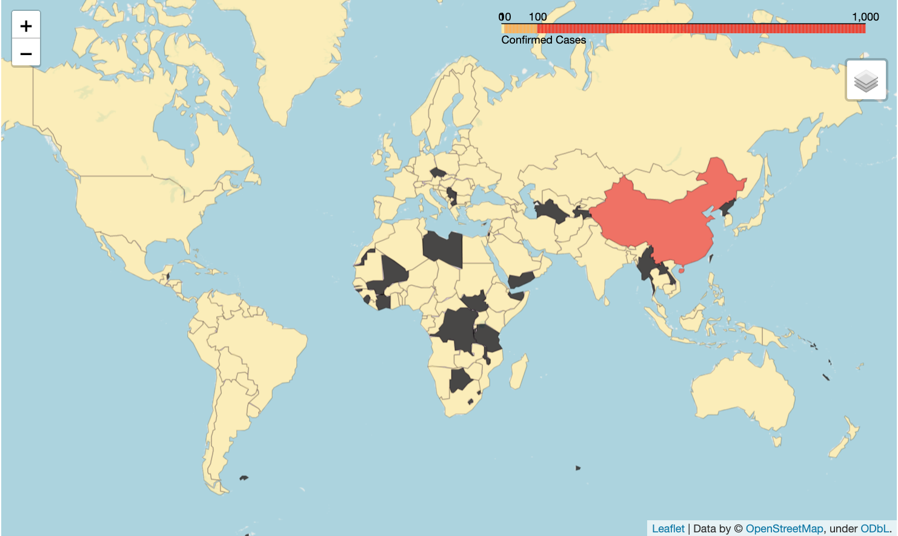
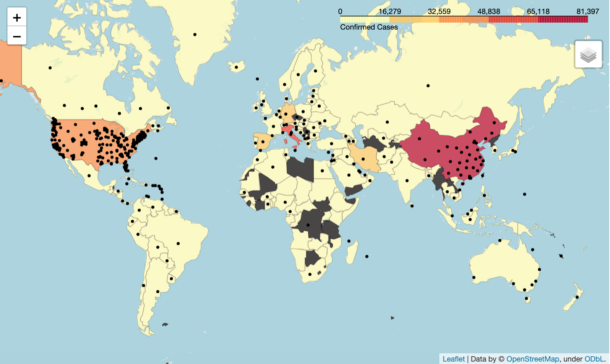
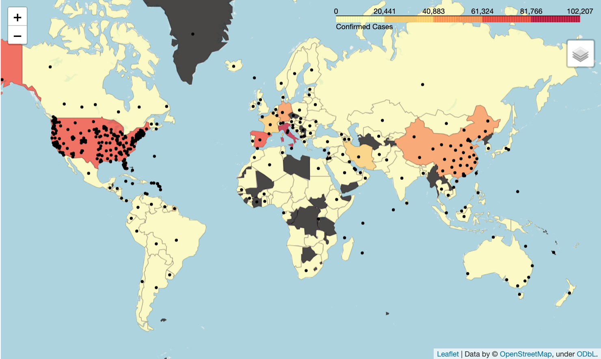
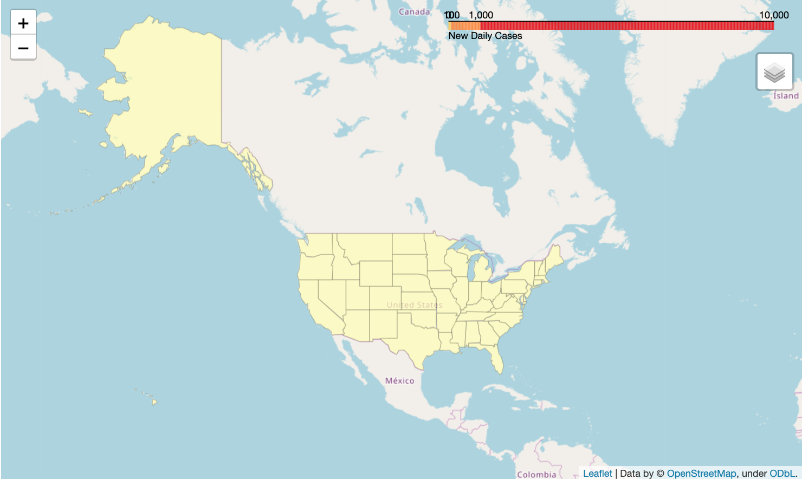
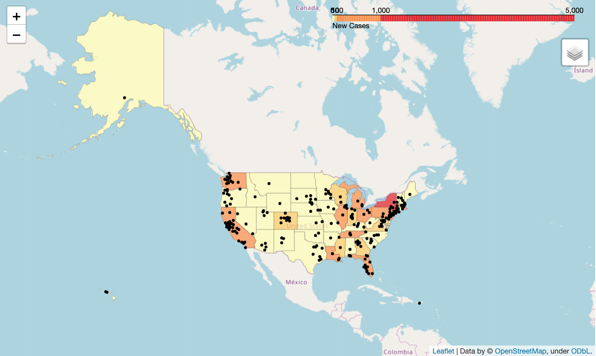
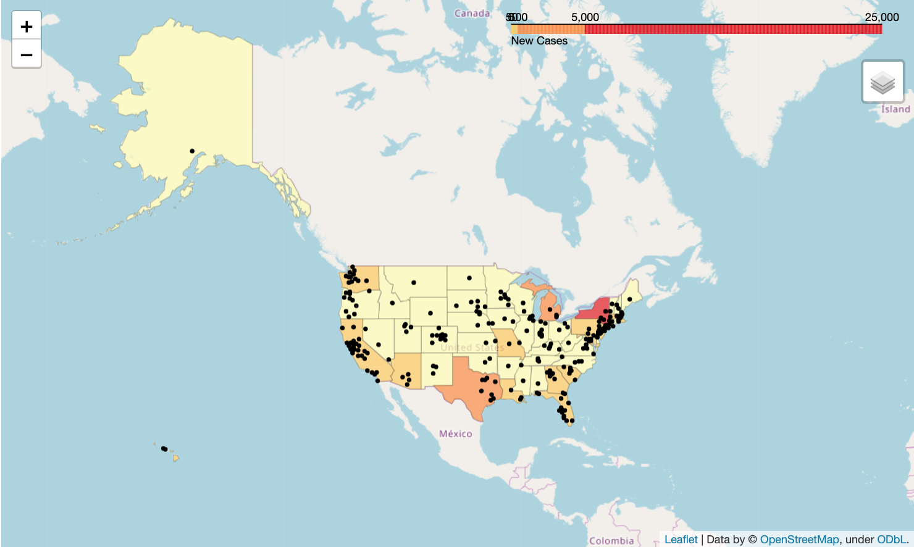

# Time Series Covid Analysis

## Data

The data used in this analysis is from the Johns Hopkins University CSSE. The data can be found [here](https://github.com/CSSEGISandData/COVID-19). There are a series of jsons containing lat-long information used for creating our maps that can be found in our data folder, [./data/geo_data/](https://github.com/dkeogh1/time-series-covid/tree/master/data/geo_data). On March 22nd, JHU CSSE switched the format of their data from tracking United States cases at higher level of granularity than on the country level. It previous had state-level information, and sometimes even county or city-level data as well. For the purposes of building models at that level, there is a also a snaphot csv from their March 22nd release that can be found within the data folder here [./data/jhu_data/](https://github.com/dkeogh1/time-series-covid/blob/master/data/jhu_data/time_series_19-covid-Confirmed_3_22.csv). For most recent data, I would suggest their most recent confirmed cases data set.

Another data set that the underlying tools in this repo could be repurposed for is the time-series panel-data that The New York Times has released, [here](https://github.com/nytimes/covid-19-data). This data is similarly formatted to the JHU CSSE data; however it is generally US-centric and makes a point preserving county and state-level information.

## Results

Two sets of models and predictions were made for this analysis. The first set of models trained a LSTM neural network on panel data for country-level cumulative confirmed cases. We then visually analyzed our results folium maps. Below are the cumulative cases world-map, where the the more red the country is labeled, the more confirmed cases there are. The first displayed is the first day in the data set, January 22nd 2020, the second is the last day of the data set when we trained these models, March 22nd 2020, and the third is the aggregation of model predictions 10 days out from the last day (in this case, April 1st 2020). Above each map is a link to an html file, which is is an interactive version of the map you're viewing.

To see walk through on how the results were collected and visualized, check out their respective notebooks; [predictions](https://github.com/dkeogh1/time-series-covid/blob/master/macro_predictions.ipynb) and [visuals](https://github.com/dkeogh1/time-series-covid/blob/master/Prediction_Visuals.ipynb).

### Cumulative Confirmed Cases - World

#### January 22nd - World Confirmed Cases

[Interactive Version](https://dkeogh1.github.io/time-series-covid/outputs/map_html/first_day_confirmed_cases.html)

_PNG_:

 

#### March 22nd - World Confirmed Cases

[Interactive Version](https://dkeogh1.github.io/time-series-covid/outputs/map_html/last_day_confirmed_cases.html)

_PNG_:

 

#### April 1st - World Confirmed Cases (10 Day-Out Prediction)

_PNG_:

[Interactive Version](https://dkeogh1.github.io/time-series-covid/outputs/map_html/10_day_world.html)

 

### New Daily Cases - United States

The second set of results is a similar analysis, performed on US states. Instead of analyzing and predicting cumulative cases, though, we create a lagging difference between teh cumulative cases from day to day to infer new-daily cases. Using this, we train models for each state to infer the number of new cases based on each one's respective past daily confirmed cases.

#### January 22nd - US States Daily Cases

[Interactive Version](https://dkeogh1.github.io/time-series-covid/outputs/map_html/first_day_new_cases_states.html)

_PNG_:

 

#### March 22nd - US States Daily Cases

[Interactive Version](https://dkeogh1.github.io/time-series-covid/outputs/map_html/last_day_new_cases_states.html)

_PNG_:

 

#### April 1st - US States Daily Cases (10 Day-Out Prediction)

_PNG_:

[Interactive Version](https://dkeogh1.github.io/time-series-covid/outputs/map_html/10_day_new_cases_states.html)

 

## Do It Yourself

As part of this repo, we have a couple built in classes to help with getting from a csv to training and using a time-series LSTM model to make some future predictions. Below is quick overview of how to get started using this code to make yourself a model! For a more detailed walk-through on how to use the tools, check out the more thorough notebook [here](https://github.com/dkeogh1/time-series-covid/blob/master/LSTM_covid_cases.ipynb). 

```python
# import the libs we need
import pandas as pd

# in-repo tools
from ML.lstm_torch import LSTM_data_loader, LSTM_Predictor, train_lstm, predict_future

# import our dataframe
tdf = pd.read_csv('time_series_covid19_confirmed_global.csv')

# set up our dataframe in our data loader
world_data_loader = LSTM_data_loader(df=tdf,
                                     region_abr=None,
                                     country=None,
                                     state_mapper=None)

# some data manipulation 
world_data_loader.subset_df()
world_data_loader.transform_df_datetime(delta=False)

# generate and transform our datasets
world_data_loader.gen_data_sets(test_data_size=7)
X_train, y_train = world_data_loader.set_seq(train=True, sequence_lenth=3)
X_test, y_test = world_data_loader.set_seq(train=False, sequence_lenth=3)
X_train = torch.from_numpy(X_train).float()
y_train = torch.from_numpy(y_train).float()
X_test = torch.from_numpy(X_test).float()
y_test = torch.from_numpy(y_test).float()

# instantiate out model; change the number of featres, neurons, layers, etc. in order to create your own architecture
model = LSTM_Predictor(
    features=1,
    neurons=512,
    sequences=3,
    layers=2,
    dropout=0.3)

# train your model
model, trainhistory, testhistory = train_lstm(model,
                                          X_train,
                                          y_train,
                                          X_test,
                                          y_test,
                                          epochs=500)


# make predictions for the length of our test data to compare with out test
outs = predict_future(n_future=len(X_test), 
                      time_data=X_test, 
                      sequece_lenth=model.sequences, 
                      model=model)

# get our truth values
true_cases = world_data_loader.scaler.inverse_transform(
    np.expand_dims(y_test.flatten().numpy(), axis=0)
).flatten()
print([int(x) for x in true_cases.tolist()])

# get our predicted values
predicted_cases = world_data_loader.scaler.inverse_transform(
  np.expand_dims(outs, axis=0)
).flatten()
print([int(x) for x in predicted_cases.tolist()])

# compare results -- the Mean Squared Error for those results is saved in the testhistory list returned by our training loop.
# since these are arrays we can plot our results out as well
```